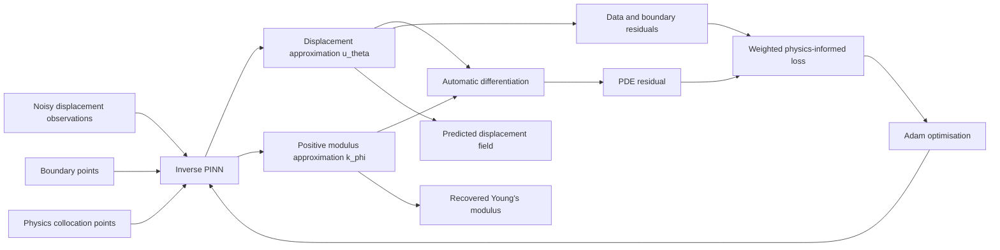
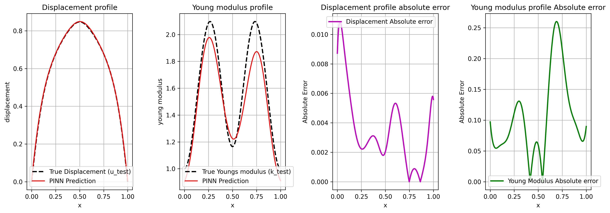
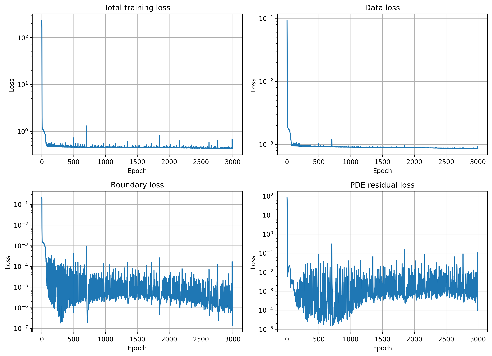

# Inverse Physics-Informed Neural Network for 1D Elastostatics

<p align="center">
  <strong>Recovering a spatially varying Young's modulus from noisy displacement measurements using physics-informed learning.</strong>
</p>

<p align="center">
  
  
  
  
</p>

This project develops an **inverse physics-informed neural network (Inverse PINN)** for identifying the unknown, spatially varying Young's modulus of a one-dimensional elastic rod.

The model combines:

- noisy displacement observations,
- the governing elastostatic equation,
- displacement boundary conditions, and
- automatic differentiation,

to reconstruct both the displacement field \(u(x)\) and the material field \(k(x)\).

The best experiment reduced the relative \(L_2\) error in the recovered Young's modulus from **19.51% to 7.53%** through improved activation selection, loss balancing, and learning-rate scheduling.

---

## Motivation

Identifying material properties from measured structural responses is a classical inverse problem.

In practice, quantities such as Young's modulus may be:

- spatially heterogeneous,
- difficult to measure directly,
- inferred only from a limited number of sensors, and
- affected by measurement noise.

Traditional parameter-identification methods repeatedly solve a forward numerical problem while updating the unknown material parameters. An Inverse PINN instead embeds the governing differential equation directly into the training objective and learns the state and material fields simultaneously.

Potential application areas include:

- material characterisation,
- structural health monitoring,
- non-destructive evaluation,
- damage or stiffness identification, and
- physics-based digital twins.

---

## Problem Definition

Consider a one-dimensional elastic rod on the domain

\[
x \in (0,L).
\]

The governing elastostatic equation is

\[
-\frac{d}{dx}\left(k(x)\frac{du(x)}{dx}\right)=f,
\]

subject to homogeneous Dirichlet boundary conditions

\[
u(0)=0,
\qquad
u(L)=0.
\]

where:

- \(u(x)\) is the displacement field,
- \(k(x)\) is the spatially varying Young's modulus,
- \(f\) is the known body force, and
- \(L\) is the rod length.

### Forward problem

Given \(k(x)\), \(f\), and the boundary conditions, determine \(u(x)\).

### Inverse problem

Given noisy observations of \(u(x)\), together with the governing equation and boundary conditions, recover the unknown field \(k(x)\).

The dataset contains displacement observations at **500 randomly sampled sensor locations** with approximately **5% measurement noise**.

---

## Inverse PINN Formulation

The model learns differentiable approximations

\[
u_\theta(x) \approx u(x),
\qquad
k_\phi(x) \approx k(x).
\]

A **Softplus** output transformation is used for the modulus prediction so that

\[
k_\phi(x)>0,
\]

which is physically consistent with a positive Young's modulus.

Automatic differentiation is used to evaluate

\[
\frac{du_\theta}{dx}
\]

and the PDE residual

\[
r_{\theta,\phi}(x)
=
-\frac{d}{dx}
\left(
k_\phi(x)\frac{du_\theta(x)}{dx}
\right)-f.
\]

The unknown modulus is therefore not fitted from displacement data alone. It must also produce a displacement field that is consistent with the governing physics.

---

## Learning Workflow



---

## Loss Function

Training minimises a weighted combination of three objectives:

\[
\mathcal{L}
=
w_{\mathrm{data}}\mathcal{L}_{\mathrm{data}}
+
w_{\mathrm{bc}}\mathcal{L}_{\mathrm{bc}}
+
w_{\mathrm{pde}}\mathcal{L}_{\mathrm{pde}}.
\]

### Displacement data loss

\[
\mathcal{L}_{\mathrm{data}}
=
\frac{1}{N_u}
\sum_{i=1}^{N_u}
\left|
u_\theta(x_i)-u_i^{\mathrm{obs}}
\right|^2.
\]

This term fits the measured displacement observations.

### Boundary-condition loss

\[
\mathcal{L}_{\mathrm{bc}}
=
|u_\theta(0)|^2+|u_\theta(L)|^2.
\]

This term enforces the prescribed displacements at the two ends of the rod.

### PDE residual loss

\[
\mathcal{L}_{\mathrm{pde}}
=
\frac{1}{N_f}
\sum_{j=1}^{N_f}
\left|
r_{\theta,\phi}(x_j)
\right|^2.
\]

This term enforces elastostatic equilibrium at collocation points inside the domain.

### Best-run loss weights

| Component | Weight |
|---|---:|
| Displacement data | 500 |
| Boundary conditions | 100 |
| PDE residual | 2 |

Loss balancing is critical in inverse PINNs because a small displacement error does not automatically guarantee an accurate reconstruction of the material field.

---

## Best Results

The best checkpoint was obtained at **epoch 2943**.

| Quantity | Best checkpoint | Final epoch |
|---|---:|---:|
| Relative \(L_2\) error in Young's modulus | **7.53%** | 7.64% |
| Relative \(L_2\) error in displacement | 0.68% | **0.31%** |
| Training time | \multicolumn{2}{c}{793.94 s (approximately 13.2 min)} |

The relative error is evaluated as

\[
\varepsilon_{\mathrm{rel}}
=
\frac{\|y_{\mathrm{pred}}-y_{\mathrm{true}}\|_2}
{\|y_{\mathrm{true}}\|_2}.
\]

The benchmark contains the ground-truth modulus field, allowing the inverse reconstruction to be evaluated quantitatively.

---

## Prediction Results

The figure below compares the true and reconstructed displacement and Young's-modulus fields. It also shows the pointwise absolute errors.

<p align="center">
  
</p>

The displacement field is recovered with high accuracy. The modulus reconstruction is more difficult because material identification is an ill-posed inverse problem: different material fields may generate similar displacement responses, especially in the presence of noise.

---

## Training Behaviour

<p align="center">
  
</p>

The training curves contain:

- total weighted loss,
- displacement-data loss,
- boundary-condition loss, and
- PDE-residual loss.

The logarithmic scale highlights the different magnitudes and convergence behaviour of the individual objectives.

---

## Hyperparameter-Tuning Study

A key outcome of this project was improving the recovered modulus rather than optimising displacement accuracy alone.

| Setting | Earlier experiment | Best experiment |
|---|---:|---:|
| Hidden activation | Tanh | **SiLU** |
| Modulus output activation | Softplus | Softplus |
| Data-loss weight | 100 | **500** |
| Boundary-loss weight | 100 | 100 |
| PDE-loss weight | 2 | 2 |
| Learning-rate scheduler | StepLR | **ReduceLROnPlateau** |
| Best modulus relative \(L_2\) error | 19.51% | **7.53%** |

This corresponds to an approximately **61% relative reduction** in the modulus-reconstruction error.

The experiment demonstrates an important inverse-problem insight:

> Accurately reproducing the observed state variable does not necessarily imply that the hidden physical parameter has been identified accurately.

---

## Best Experiment Configuration

| Parameter | Value |
|---|---:|
| Method | Inverse PINN |
| Hidden activation | SiLU |
| Modulus output activation | Softplus |
| Epochs | 3000 |
| Batch size | 200 |
| Optimiser | Adam |
| Initial learning rate | \(10^{-3}\) |
| Weight decay | \(10^{-4}\) |
| Scheduler | ReduceLROnPlateau |
| Scheduler factor | 0.5 |
| Scheduler patience | 100 |
| Observation points | 500 |
| Physics collocation points | 5000 |
| Domain length | 1.0 |
| Device used for the logged run | CUDA |

---

## Project Structure

```text
Inverse_PINNs_1D_Elastostatics/
│
├── Problem_A.ipynb
│   └── Main notebook containing data loading, model definition,
│       training, evaluation, plotting, and experiment logging
│
├── ProblemA_dataset.h5
│   └── Displacement observations and reference problem data
│
├── pinn_dataset.py
│   └── PyTorch Dataset wrapper
│
├── experiments/
│   ├── recover_young_modulus_<timestamp>/
│   │   ├── config.json
│   │   ├── metrics.csv
│   │   ├── best_epoch.json
│   │   ├── training_history.npz
│   │   ├── checkpoints/
│   │   └── figures/
│   └── ...
│
└── Results/
    └── Additional result plots from the development experiments
```

Development-environment and cache directories are omitted from this overview.

---

## Running the Project

The Jupyter notebook is the primary entry point.

### 1. Clone the repository

```bash
git clone https://github.com/sourav0208/Inverse_PINNs_1D_Elastostatics.git
cd Inverse_PINNs_1D_Elastostatics
```

### 2. Create and activate a virtual environment

```bash
python -m venv .venv
```

On Windows:

```bash
.venv\Scripts\activate
```

On Linux or macOS:

```bash
source .venv/bin/activate
```

### 3. Install the core dependencies

```bash
pip install torch numpy pandas matplotlib h5py jupyter
```

For GPU training, install the PyTorch build compatible with the installed CUDA version.

### 4. Start Jupyter

```bash
jupyter notebook
```

Open:

```text
Problem_A.ipynb
```

and execute the cells in order.

---

## Experiment Tracking

Each training run is stored in a timestamped directory:

```text
experiments/recover_young_modulus_<timestamp>/
```

A run may contain:

- the complete hyperparameter configuration,
- per-epoch metrics,
- the best-epoch summary,
- NumPy training history,
- model checkpoints, and
- generated figures.

This makes it possible to compare experiments without overwriting earlier results.

---

## Reproducibility

The repository supports reproducible scientific experimentation through:

- version-controlled code,
- saved configuration files,
- timestamped experiment directories,
- stored training histories,
- saved checkpoints, and
- quantitative error metrics for both state and parameter recovery.

For stronger reproducibility across machines, future versions should additionally include:

- a pinned `requirements.txt` or `environment.yml`,
- explicit random-seed logging,
- hardware and software version metadata, and
- automated tests for the PDE residual and boundary conditions.

---

## Engineering and Scientific-ML Highlights

This project demonstrates:

- formulation of an inverse parameter-identification problem,
- physics-informed learning with noisy sensor data,
- simultaneous recovery of state and material fields,
- higher-order automatic differentiation,
- positivity enforcement for physical parameters,
- multi-objective loss balancing,
- hyperparameter and scheduler comparison,
- GPU-accelerated PyTorch training,
- experiment tracking and checkpointing, and
- quantitative validation against a known reference solution.

---

## Limitations

The present study is a controlled one-dimensional benchmark.

Current limitations include:

- one-dimensional linear elastostatics,
- known loading and boundary conditions,
- synthetic displacement observations,
- fixed sensor and collocation-point strategies,
- no uncertainty quantification,
- sensitivity to noise and loss weights, and
- no direct comparison with classical PDE-constrained optimisation.

The reported accuracy should therefore be interpreted as benchmark performance rather than a claim of immediate applicability to arbitrary experimental structures.

---

## Future Extensions

Possible next steps include:

- extending the formulation to 2D and 3D elasticity,
- identifying piecewise-discontinuous or anisotropic material fields,
- studying robustness across multiple noise levels,
- reducing the number of displacement sensors,
- adaptive collocation-point sampling,
- dynamic or gradient-based loss weighting,
- uncertainty quantification with Bayesian or ensemble methods,
- comparison with FEM-based inverse optimisation,
- joint recovery of loads, boundary parameters, and material properties, and
- automated testing and command-line experiment execution.

---

## Technologies Used

- Python
- PyTorch
- Jupyter Notebook
- NumPy
- Pandas
- Matplotlib
- HDF5 / h5py
- CUDA


---

## Author

    Sourav
    MSc Computational Mechanics  
    Technical University of Munich

---

# License

This project is released under the **MIT License**.
